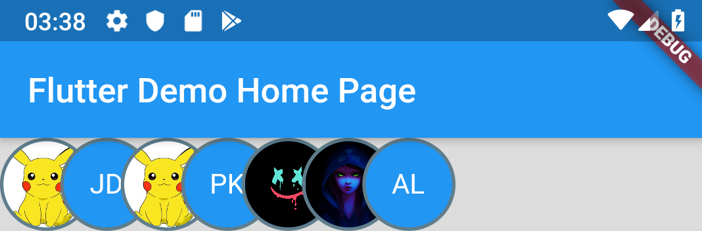
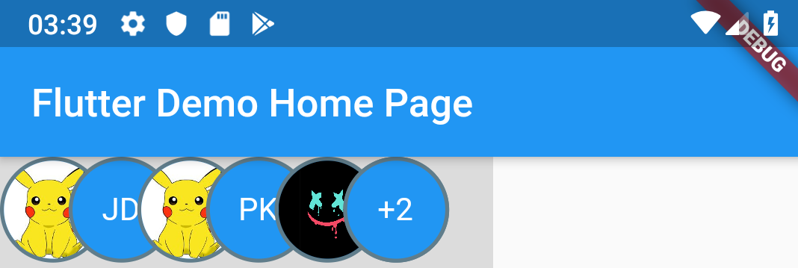

# members_widget

Check members.dart to find easy-to-use widget to show grouppd avatars e.g members of event. 



with grouping items that cannot be shown on the screen 



## Getting Started

You have to extend your data model with mixin 

``` dart
abstract class MemberMixin {
  factory MemberMixin._() => null;

  bool hasAvatar(); 
  String avatarUrl(); 
  String initials();
}
```

for example let's create an User: 

``` dart
class User with MemberMixin {
  String imageUrl;
  String firstName; 
  String lastName;

  User({this.imageUrl, this.firstName, this.lastName});

  @override
  String avatarUrl() {
    return imageUrl;
  }

  @override
  bool hasAvatar() {
    return imageUrl != null;
  }

  @override
  String initials() {
    return firstName.substring(0,1)+""+lastName.substring(0,1);
  }
}
```

and then use it: 

``` dart 
 @override
  Widget build(BuildContext context) {
    return Scaffold(
      appBar: AppBar(
        title: Text(widget.title),
      ),
      body: Center(
        child: Container(
          margin: EdgeInsets.only(left: 0, right: 160),
          color: Colors.black12,
          alignment: Alignment.center,
          child:
            Members(members: [
                User(firstName: "John", lastName: "Wayne", imageUrl: "https://i1.sndcdn.com/avatars-000475270878-w0r5zp-t500x500.jpg"),
                User(firstName: "Joe", lastName: "Doe"),
                User(firstName: "John", lastName: "Wayne", imageUrl: "https://i1.sndcdn.com/avatars-000475270878-w0r5zp-t500x500.jpg"),
                User(firstName: "Peter", lastName: "Kowalsky"),
                User(firstName: "John", lastName: "Wayne", imageUrl: "https://avatarfiles.alphacoders.com/194/194221.jpg"),
                User(firstName: "Ann", lastName: "Lee", imageUrl: "https://avatarfiles.alphacoders.com/103/103875.png"),
                User(firstName: "Ann", lastName: "Lee")
            ])
          ,
        ),
      )
  }
```

